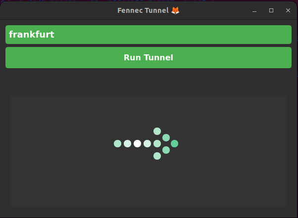

# Fennec Tunnel 🦊 - OpenVPN3 Client

**Fennec Tunnel** is a lightweight Docker-based client for easily connecting to OpenVPN3 networks. It simplifies the connection process by running OpenVPN3 within a Docker container and provides a straightforward interface for managing connections.

## Features 🦊

- **Lightweight**: A minimal client that connects to OpenVPN3 networks using Docker.
- **Docker-based**: Runs in a containerized environment for easier setup and portability.
- **Simple Setup**: Just set the `OPENVPN_PROFILES` environment variable and run the script.
- **Cross-Platform**: Works on any platform that supports Docker.

## Requirements 🦊

- Docker (with proper permissions)
- OpenVPN3 configuration profiles

## Installation 🦊

### Step 1: Clone the Repository

Clone or download the repository to your local machine.

```bash
git clone https://github.com/KnollYehuda/fennec-tunnel.git
cd fennec-tunnel
```

### Step 2: Set the OpenVPN Profiles Path

Set the `OPENVPN_PROFILES` environment variable to the path where your OpenVPN3 profiles are stored. The profiles directory should contain the `.ovpn` files.

For example, run the following command in your terminal:

```bash
export OPENVPN_PROFILES=/path/to/openvpn/profiles
```
> **Warning**: Make sure that the `OPENVPN_PROFILES` directory is valid and contains the necessary OpenVPN configuration files (`.ovpn`). If the directory is incorrect or empty, the application will not be able to establish a VPN connection.

### Step 3: Start the Docker container

Run the following command to execute the `start.sh` script, which will build the Docker image and start the Fennec Tunnel container:

```bash
./start.sh
```

### Step 4: Using the Application

Once the container is running, the Fennec Tunnel application will start. You can interact with the application through the UI:

- **Select an OpenVPN profile** from the list of available profiles.
- The application will establish a VPN connection using the selected profile.

You can monitor the connection status through the UI and interact with the application accordingly.

### Step 5: Troubleshooting

If you encounter any issues, here are some common steps to troubleshoot:

- **Check the OpenVPN profiles path**: Ensure the `OPENVPN_PROFILES` directory is set correctly and contains valid `.ovpn` files.
- **Permissions**: Make sure you have the necessary permissions for the Docker commands and the required files.

## Application Screenshot 🦊


